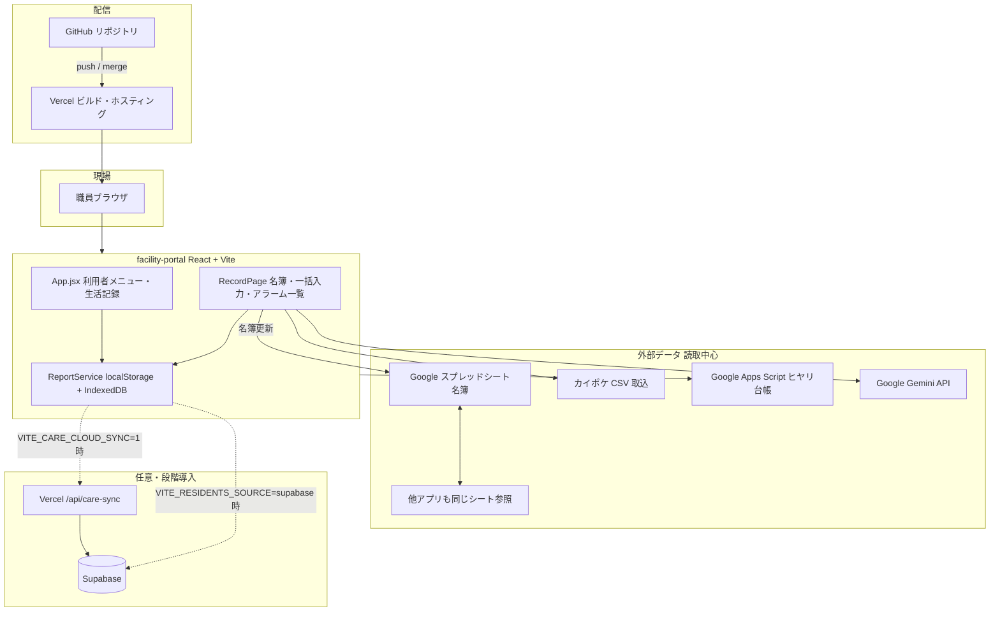
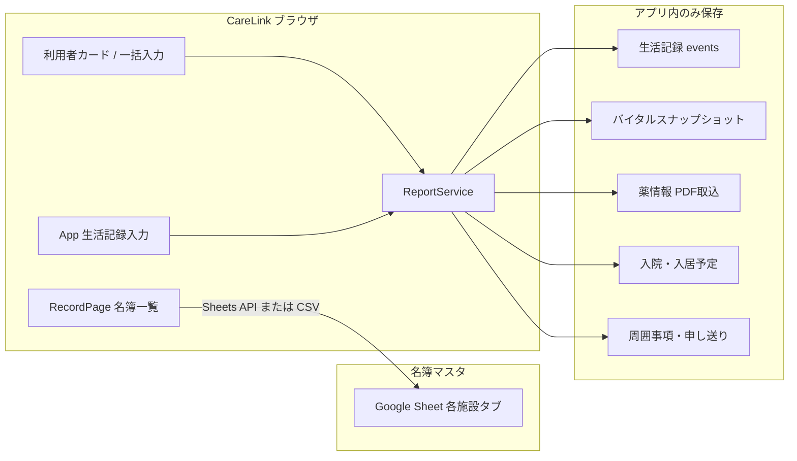
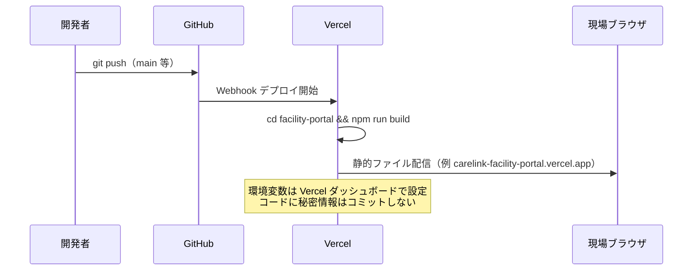
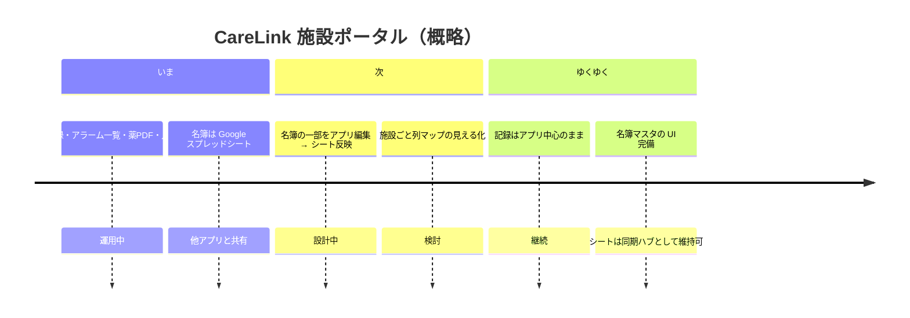

# CareLink 施設ポータル — 共同開発向け設計図

最終更新: 2026-06（現状スナップショット）

オーナー・共同開発者が「いまどこまでできているか」「GitHub / 本番 / バックアップ」を共有するための文書です。  
詳細な運用指示はリポジトリ直下の [`Instructions.md`](../Instructions.md)、環境変数は [`facility-portal/.env.example`](../facility-portal/.env.example) を参照してください。

---

## 1. 全体像（いまの段階）



### 現フェーズの位置づけ

| 領域 | 状態 | 補足 |
|------|------|------|
| 生活記録・バイタル・食事・巡視 | **運用中（アプリ正）** | 端末の localStorage / IndexedDB、5年保管方針 |
| 利用者名簿（氏名・居室・介護度・病名等） | **スプレッドシート正** | 他アプリと共有のためシート更新が必要 |
| 薬局PDF・情報提供書・入院状況 | **アプリに保存** | 名簿 ID に紐づけ |
| 名簿の新規登録・編集 UI | **未実装** | 将来はアプリ入力 → シート書き戻しを想定 |
| Supabase 名簿 | **オプション** | `VITE_RESIDENTS_SOURCE=supabase` |
| 生活記録クラウド同期 | **オプション** | `VITE_CARE_CLOUD_SYNC` + `/api/care-sync` |
| Python バッチ・Slack 等 | **別フォルダ** | `integrations/` `operations/` はポータル外 |

---

## 2. リポジトリ構成

```
CareLink_AI/
├── facility-portal/     ★ 本番 UI（Vercel の Root Directory はここ）
│   ├── src/
│   │   ├── App.jsx              利用者選択・生活記録・詳細履歴
│   │   ├── pages/RecordPage.jsx 施設名簿・一括表・CSV/PDF取込
│   │   ├── services/
│   │   │   ├── ReportService.js   永続化の中心（LS + IDB）
│   │   │   └── GoogleSheetService.js 名簿取得
│   │   ├── config/carelinkFacilities.js  施設タブ・列マップ
│   │   └── lib/                   バックアップ・PDF・同期など
│   ├── api/                       Vercel Serverless（care-sync, near-miss-gas）
│   └── docs/VERCEL_NEW_TENANT_CHECKLIST.md
├── supabase/migrations/   DB スキーマ（名簿・生活記録同期用）
├── docs/                  設計・マニュアル（本ファイル含む）
├── integrations/          カイポケ・Slack 等（ポータル外）
├── operations/            監査・人員換算スクリプト
└── Instructions.md        AI CEO / オーナー向け運用指示
```

---

## 3. 画面とデータの流れ



- **名簿を変える** → スプレッドシートを更新 → Record 画面の「更新」で再取得。  
- **記録を変える** → アプリのみ（原則シートに書かない）。  
- 施設ごとにシートの列名・列位置が違う → `carelinkFacilities.js` + `GoogleSheetService` のヘッダ照合で吸収（[`施設差の説明`](./CARELINK_DEVELOPER_ARCHITECTURE.md#6-施設ごとのスプレッドシート差)）。

---

## 4. GitHub と Vercel のつながり



### 開発者がやること

1. リポジトリを clone  
2. `facility-portal/.env.local` を `.env.example` から作成（API キーは共有チャネルで受け取り、**Git に載せない**）  
3. `cd facility-portal && npm install && npm run dev`  
4. 変更はブランチ → PR → merge が基本（運用ルールはチームで合意）

### 本番デプロイ

- **Root Directory**: `facility-portal`  
- **ビルド**: `npm run build`（Vite）  
- **設定**: [`facility-portal/docs/VERCEL_NEW_TENANT_CHECKLIST.md`](../facility-portal/docs/VERCEL_NEW_TENANT_CHECKLIST.md)（会社ごとに Vercel プロジェクトを分ける方式Aあり）  
- 反映後、現場は **Ctrl+F5** 強制再読み込み推奨（キャッシュ対策は `vercel.json` で index は no-store）

### GitHub Actions

現時点、リポジトリ内に `.github/workflows` は **未整備**（CI は Vercel のビルド成功/失敗で確認）。共同開発で PR チェックを足す場合はここに lint/test を追加する想定。

---

## 5. バックアップの仕組み（多層）

```mermaid
flowchart TB
  subgraph primary [日常の正本]
    LS[localStorage carelink_os_*]
    IDB[IndexedDB 生活記録・PDF等]
  end

  subgraph auto [自動]
    T2359[毎日 23:59 JST 自動]
    T2359 --> JSON1[JSON ファイル生成]
    JSON1 --> DL[ブラウザダウンロード or SSD フォルダ]
    JSON1 --> IDBsnap[IndexedDB 日次スナップショット]
  end

  subgraph manual [手動・管理者]
    PIN[BACKUP_ADMIN_PASSWORD]
    PIN --> UI[設定: バックアップ/復元 UI]
    UI --> JSON2[JSON エクスポート/インポート]
  end

  subgraph cloud [任意]
    SYNC[VITE_CARE_CLOUD_SYNC=1]
    SYNC --> API[/api/care-sync]
    API --> SB[(Supabase care_events / snapshots)]
  end

  LS --> T2359
  IDB --> T2359
  LS --> UI
  LS -.-> SYNC
```

| 層 | 内容 | 誰が触るか |
|----|------|------------|
| **端末内** | 生活記録・バイタル・薬情報・周囲事項など | 自動（アプリ利用時） |
| **23:59 自動** | 全 `carelink_os_*` を JSON 化。タブを開いた PC のみ | 設定不要で動作 |
| **SSD / フォルダ** | File System Access API で指定フォルダへ二重保存 | 管理者 PIN 解除後 |
| **手動 JSON** | ダウンロード・ファイルから復元 | 管理者 PIN |
| **Supabase** | 生活記録のクラウド upsert・日次スナップショット | 環境変数有効時のみ |

実装の入口:

- [`facility-portal/src/lib/careDataBackup.js`](../facility-portal/src/lib/careDataBackup.js) — バックアップ JSON の中身  
- [`facility-portal/src/lib/careAutoBackup.js`](../facility-portal/src/lib/careAutoBackup.js) — 23:59 スケジューラ  
- [`facility-portal/src/components/CareAutoBackupPanel.jsx`](../facility-portal/src/components/CareAutoBackupPanel.jsx) — 設定画面 UI  

**注意**: 名簿（スプレッドシート）自体のバックアップは Google 側の版管理・コピーが別途必要。CareLink の JSON バックアップは **アプリに溜まった記録** が主対象。

---

## 6. 施設ごとのスプレッドシート差

| 仕組み | ファイル |
|--------|----------|
| 施設タブ名・読取範囲・固定列 | `facility-portal/src/config/carelinkFacilities.js` |
| ヘッダ別名（氏名・病名・在宅医…） | `facility-portal/src/services/GoogleSheetService.js` |

他アプリとシートを共有するため、**名簿の正はシートのまま**。将来的にアプリで名簿編集する場合は **シートへの書き戻し** をセットで設計する方針（共同開発の前提）。

---

## 7. 主要な環境変数（抜粋）

| 変数 | 用途 |
|------|------|
| `VITE_GOOGLE_SHEETS_API_KEY` | 名簿・各種シート読取 |
| `VITE_GEMINI_API_KEY` | 薬局PDF・情報提供書 AI |
| `VITE_FACILITY_PORTAL_PASSWORD` | 施設画面ロック（任意） |
| `VITE_BACKUP_ADMIN_PASSWORD` | バックアップ UI の PIN |
| `VITE_RESIDENTS_SOURCE=supabase` | 名簿を DB から（実験・移行用） |
| `VITE_CARE_CLOUD_SYNC` + `CARE_SYNC_SECRET` | 生活記録クラウド同期 |
| `NEAR_MISS_APP_SECRET` | ヒヤリ GAS 中継（サーバのみ） |

一覧: [`facility-portal/.env.example`](../facility-portal/.env.example)

---

## 8. ロードマップ（共同開発で共有したい方向）



---

## 9. 共同開発の入口チェックリスト

- [ ] GitHub リポジトリへ招待済み  
- [ ] `facility-portal` で `npm run dev` が起動する  
- [ ] `.env.local` を受け取り（**コミットしない**）  
- [ ] Vercel のデプロイ URL と本番ブランチを確認  
- [ ] 名簿用スプレッドシートは **閲覧権限** のみ渡す（編集は運用ルールに従う）  
- [ ] 本ファイルと `Instructions.md` を一読  

---

## 10. 関連ドキュメント

| 文書 | 内容 |
|------|------|
| [`Instructions.md`](../Instructions.md) | 会社目標・AI CEO 運用・優先テーマ |
| [`facility-portal/.env.example`](../facility-portal/.env.example) | 環境変数テンプレート |
| [`facility-portal/docs/VERCEL_NEW_TENANT_CHECKLIST.md`](../facility-portal/docs/VERCEL_NEW_TENANT_CHECKLIST.md) | 新テナント Vercel 手順 |
| [`docs/carelink_record_document_flow.md`](./carelink_record_document_flow.md) | 看護記録・計画書の文書連動（別ドメイン） |
| [`supabase/migrations/`](../supabase/migrations/) | DB スキーマ履歴 |

---

*図は GitHub 上で Mermaid 対応ビューア（プレビュー）にすると表示されます。PDF 化する場合は VS Code の Markdown PDF 拡張や [Mermaid Live Editor](https://mermaid.live) を利用してください。*
