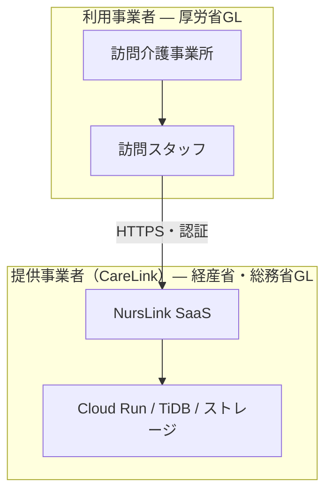

# NursLink セキュリティ・コンプライアンス統合レポート

**3省2ガイドライン・要配慮個人情報・個人情報保護法 対応状況（網羅版）**

| 項目 | 内容 |
|------|------|
| 作成日 | 2026年6月13日 |
| 版 | 1.0（統合版） |
| 対象システム | NursLink（訪問介護業務支援 SaaS） |
| 運営会社 | 合同会社 CareLink |
| 文書種別 | 自己評価・初回リスクアセスメント記録 |
| 次回見直し予定 | 2027年6月（年1回） |

---

## 免責事項

本レポートは NursLink の現時点における技術実装・運用状況に基づく**自己評価**です。

- 3省2ガイドラインへの**完全準拠を保証するものではありません**
- ISMS（ISO/IEC 27001）・プライバシーマーク等の**第三者認証の代替にはなりません**
- 医療機関・訪問介護事業者への本番提供前には、専門家によるレビューを推奨します

対外説明では「**主要な技術的安全管理措置を実施**」「**残存リスクを認識し対応中**」という表現に留めてください。

---

## 1. 監査の目的と範囲

### 1.1 目的

1. **3省2ガイドライン**の要求事項を網羅的に洗い出し、NursLink の対応状況を可視化する
2. **要配慮個人情報**（個人情報保護法第2条第3項）の取り扱いを特定し、安全管理措置を評価する
3. 医療機関・利用事業者との**責任分界**を明確化し、契約・開示書類のたたき台とする
4. 残存リスクと優先度付きロードマップを策定する

### 1.2 対象

| 対象 | 含む | 含まない |
|------|------|----------|
| アプリケーション | NursLink Web アプリ（訪問介護記録・利用者管理・スタッフ管理） | CareLink 施設ポータル（別プロダクト） |
| インフラ | Cloud Run、Manus 基盤、TiDB Cloud、オブジェクトストレージ | 利用事業者の端末・社内 LAN |
| データ | 利用者情報、訪問記録、ケアノート、医療報告、アルコールチェック等 | 利用事業者が紙・他システムで管理する情報 |

### 1.3 監査基準（3省2ガイドライン）

「**3省2ガイドライン**」とは、医療情報を扱うシステムに関し、3省が策定した次の**2文書**の総称です。

| # | 正式名称 | 発行 | 最新版 | 主な適用対象 |
|---|----------|------|--------|--------------|
| A | 医療情報システムの安全管理に関するガイドライン | 厚生労働省 | **第6.0版**（2023年5月） | 医療機関・**介護事業者**（システム利用者） |
| B | 医療情報を取り扱う情報システム・サービスの提供事業者における安全管理ガイドライン | 経済産業省・総務省 | **第2.0版**（2025年3月28日改定）※ | **SaaS・クラウド事業者**（CareLink） |

※ 第1.1版（2023年7月）から第2.0版へ改定。本レポートは**第2.0版を主基準**とし、第1.1版からの主な追加・強化点を併記する。

#### 第2.0版で特に強化された点（経産省・総務省ガイドライン）

1. **対象事業者の範囲** — クラウド事業者・保守事業者に加え、サプライチェーン上で医療情報に触れる全事業者
2. **医療機関との責任分界・合意形成** — SLA・**サービス仕様適合開示書**による文書化が必須
3. **リスクベースアプローチ** — 画一的対策ではなく、サービス形態に応じたリスクアセスメント

---

## 2. 適用主体と責任分界

NursLink は **SaaS 提供事業者（合同会社 CareLink）** が運営し、**訪問介護事業者**が利用する二層構造です。

| 責任領域 | 提供事業者（CareLink） | 利用事業者（訪問介護事業所） |
|----------|------------------------|------------------------------|
| システムの可用性・障害対応 | ○（SLA で定義） | △（契約・連絡体制） |
| 認証・アクセス制御の実装 | ○ | △（アカウント管理・退職者削除の運用） |
| 端末・ネットワークの安全管理 | × | ○ |
| 医療・介護記録の内容の正確性 | × | ○ |
| クラウド上のデータ暗号化・バックアップ | ○ | × |
| 委託先（再委託）の管理 | ○ | △（委託契約・監督） |
| インシデント発生時の一次対応 | ○ | ○（連絡・現場対応） |
| 利用者への説明・同意取得 | △（システム機能の提供） | ○ |

**未整備（要対応）:** 上記責任分界の**書面化**（サービス仕様適合開示書・SLA・利用規約）は本レポート作成時点で未完了。

---

## 3. 要配慮個人情報の特定

個人情報保護法第2条第3項に基づき、本システムが取り扱う要配慮個人情報を以下に特定する。

| 情報種別 | 格納先（テーブル・カラム） | 要配慮該当理由 | 暗号化優先度 |
|----------|---------------------------|----------------|--------------|
| 介護度 | `clients.careLevel` | 身体・精神障害、要介護状態 | 高 |
| ケア内容 | `clients.careContent` | 同上 | **最優先** |
| 主治医 | `clients.primaryDoctorName` | 病歴・医療情報 | 高 |
| 薬局・服薬 | `clients.pharmacyName` 等 | 病歴・医療情報 | 高 |
| 注意事項・特記 | `clients.cautionNote`, `clients.notes` | 健康状態 | **最優先** |
| 訪問ケアノート | `care_notes.content` | 診療・介護記録 | **最優先** |
| 医療報告 | `medical_reports` | 診療・介護記録 | **最優先** |
| アルコールチェック | `alcohol_checks` | 健康状態 | 中 |

**現状:** 上記フィールドは DB 上**平文保存**（TiDB の保存時暗号化・通信 TLS は適用済み）。**フィールドレベル暗号化は未実装**。

---

## 4. ガイドライン別 網羅チェックリスト

凡例: ✅ 対応済 / ⚠️ 部分対応・未実装 / 📋 運用・文書で対応要 / N/A 提供事業者の直接責任外

---

### 4.A 厚生労働省ガイドライン 第6.0版（利用事業者向け — SaaS 側で実装する部分）

厚労省GLは利用事業者が遵守する指針だが、SaaS として**利用者が遵守できる機能・仕様を提供する**責任がある。

#### A-1 リスクマネジメント

| 要件 | 状況 | NursLink の対応 / 備考 |
|------|------|------------------------|
| リスクアセスメントの実施 | ⚠️ | 本レポートが初回アセスメント。年1回見直しを運用規程化要 |
| リスクに応じた安全管理措置 | ⚠️ | 技術措置は部分実装。MFA・フィールド暗号化が残存リスク |
| 委託先（SaaS）の選定・監督 | 📋 | 利用事業者側の責任。開示書・SLA の提供で支援 |

#### A-2 アクセス制御

| 要件 | 状況 | 実装内容 |
|------|------|----------|
| 利用者識別・認証 | ✅ | bcrypt（コスト12）、JWT（HS256）セッション |
| 最小権限の原則 | ✅ | `admin` / `user` ロール、`adminProcedure` / `protectedProcedure` |
| 担当データのみ参照 | ✅ | `visit.staffId !== ctx.user.id` による所有権チェック |
| アカウントロック（ブルートフォース） | ✅ | 5回失敗で15分ロック、`login_attempts`、IP 記録 |
| パスワード強度 | ✅ | 8文字以上・英字・数字混在必須 |
| 多要素認証（MFA） | ⚠️ | **未実装**（外部アクセス時の必須化 — 優先度：高） |
| セッション有効期限 | ✅ | Cookie 8時間、`shared/const.ts` |
| 不活動タイムアウト | ✅ | 30分無操作で自動ログアウト（`useSessionTimeout`） |
| セッションのサーバ側無効化 | ⚠️ | JWT のみ。パスワード変更後の全端末失効は未実装 |

#### A-3 ログ・監査

| 要件 | 状況 | 実装内容 |
|------|------|----------|
| ログイン成功・失敗の記録 | ✅ | `audit_logs` / `login_attempts`、IP・UserAgent |
| ログアウトの記録 | ⚠️ | **要実装確認** — Cookie 削除のみの場合は DB 記録を追加 |
| 利用者情報 CRUD の記録 | ✅ | `create_client` / `update_client` / `delete_client` |
| 訪問記録の操作記録 | ✅ | `update_visit` / `delete_visit` / `update_visit_status` |
| アルコールチェック記録 | ✅ | `alcohol_check` |
| スタッフ削除 | ✅ | `delete_staff` |
| ファイルアクセスログ | ⚠️ | `/manus-storage/*` 参照ログ未記録 |
| ログの改ざん防止 | ⚠️ | DB 追記のみ。不変ストレージ・WORM は未導入 |
| ログ保存期間（90日以上推奨） | ⚠️ | 自動削除ポリシー未実装 |
| 管理者によるログ閲覧 | ✅ | 管理画面「監査ログ」タブ |
| 定期ログレビュー | 📋 | 運用規程で年1回以上を規定要 |

#### A-4 通信・暗号化

| 要件 | 状況 | 実装内容 |
|------|------|----------|
| TLS 通信 | ✅ | Cloud Run / Manus、TLS 1.2 以上 |
| HSTS | ✅ | `max-age=31536000; includeSubDomains; preload` |
| セキュア Cookie | ✅ | `httpOnly`, `secure`, `sameSite` |
| DB 接続暗号化 | ✅ | TiDB Cloud SSL/TLS |
| 保存データのフィールド暗号化 | ⚠️ | 要配慮フィールド平文（優先度：高） |

#### A-5 システム運用・変更管理

| 要件 | 状況 | 備考 |
|------|------|------|
| 変更時の利用事業者への通知 | ⚠️ | 変更管理プロセス・通知手順を文書化要 |
| バックアップ・復旧 | ⚠️ | TiDB Cloud 依存。RPO/RTO を SLA に明記要 |
| インシデント対応 | ⚠️ | 手順書・連絡体制図を策定要 |

---

### 4.B 経済産業省・総務省ガイドライン 第2.0版（SaaS 提供事業者 — CareLink の直接責任）

#### B-1 リスクマネジメント（第2.0版強化）

| 要件 | 状況 | 備考 |
|------|------|------|
| リスクアセスメントの実施・記録 | ⚠️ | 本レポート＝初回。リスク台帳の継続更新要 |
| リスクベースの措置選定 | ⚠️ | 残存リスクに優先度付け済み（セクション6） |
| サプライチェーンリスク | ⚠️ | Manus / Cloud Run / TiDB の確認書・契約条項要確認 |

#### B-2 技術的安全管理措置

| 要件 | 状況 | 実装内容 |
|------|------|----------|
| 認証・アクセス制御 | ✅ | セクション 4.A-2 参照 |
| 通信の暗号化 | ✅ | TLS / HSTS / DB SSL |
| 不正アクセス対策（レート制限） | ✅ | グローバル 500req/15分、認証 20req/15分 |
| セキュリティ HTTP ヘッダー | ✅ | helmet（CSP, X-Frame-Options, nosniff 等）`server/_core/index.ts` |
| SQL インジェクション対策 | ✅ | Drizzle ORM（パラメータ化） |
| XSS 対策 | ✅ | React エスケープ、CSP、Zod バリデーション |
| ストレージ未認証遮断 | ✅ | `/manus-storage/*` → 401 `storageProxy.ts` |
| エラー情報の非開示 | ✅ | tRPC `errorFormatter`、本番スタックトレース除去 |
| 要配慮情報の暗号化保存 | ⚠️ | 未実装 |

#### B-3 ログ管理

| 要件 | 状況 | 実装内容 |
|------|------|----------|
| 操作履歴の取得 | ✅ | セクション 4.A-3 参照（8種類以上） |
| IP アドレス記録 | ✅ | `X-Forwarded-For` 対応 |
| ログの可用性・保全 | ⚠️ | 90日保持・アーカイブ方針要 |
| ログの定期レビュー | 📋 | 運用規程化要 |

#### B-4 組織的・管理的安全管理措置（第2.0版の中核）

| 要件 | 状況 | 備考 |
|------|------|------|
| 安全管理責任者の選任 | 📋 | 組織規程で明記要 |
| 医療機関・利用事業者との**責任分界** | ⚠️ | **サービス仕様適合開示書**未作成（優先度：高） |
| **SLA**（稼働率・障害対応） | ⚠️ | 未作成（優先度：高） |
| 利用規約・個人情報取扱方針 | ⚠️ | 未整備（優先度：高） |
| 従業員・開発者の教育 | 📋 | 年1回以上のセキュリティ教育を規定要 |
| インシデント対応手順 | ⚠️ | 未策定（優先度：中） |
| 変更管理・利用者への通知 | ⚠️ | 未策定（優先度：中） |
| 委託先・再委託先管理 | ⚠️ | Cloud Run / TiDB / Manus の契約・確認要 |
| 第三者評価（ISMS / Pマーク） | ⚠️ | 未取得（優先度：低〜中、事業拡大時） |

#### B-5 サービス仕様適合開示書（第2.0版 必須文書）

経産省別紙1「ガイドラインに基づくサービス仕様適合開示書及び SLA 参考例」に基づき、以下を文書化する必要がある。

| 開示項目 | 状況 | NursLink で記載すべき内容（たたき台） |
|----------|------|--------------------------------------|
| サービス概要 | 📋 | 訪問介護業務支援 SaaS |
| データ保存場所 | 📋 | 日本国内（Cloud Run リージョン、TiDB リージョンを明記） |
| データの暗号化 | 📋 | 通信 TLS、保存時（TiDB）、フィールド暗号化は対応予定 |
| バックアップ | 📋 | TiDB Cloud のバックアップ方針・復旧目標 |
| 稼働率目標 | 📋 | SLA で数値目標を設定 |
| 障害時連絡・対応 | 📋 | 連絡先・初動時間・エスカレーション |
| 責任分界 | 📋 | セクション2の表を契約用に展開 |
| サブコンラクタ（再委託） | 📋 | Google Cloud、TiDB Cloud、Manus 等 |
| ログ・監査の提供 | 📋 | 監査ログの提供範囲・方法 |

**ステータス: 未作成** — 本番提供前の必須成果物。

---

### 4.C 個人情報保護法（通則編・要配慮個人情報）

| 要件 | 状況 | 実装内容 |
|------|------|----------|
| 安全管理措置（技術・組織） | ⚠️ | 技術措置は部分実装。組織措置は文書化要 |
| 利用目的の特定・公表 | ⚠️ | プライバシーポリシー要整備 |
| 第三者提供・委託の規律 | ⚠️ | 利用規約・委託契約要整備 |
| クライアント側キャッシュ禁止 | ✅ | localStorage への個人情報保存を削除 |
| Cache-Control | ✅ | `no-store` |
| 漏洩等時の報告体制 | ⚠️ | インシデント手順書に含める |

---

## 5. 実装マッピング（コード・設定）

| 機能 | ファイル / 設定 | 対応ガイドライン |
|------|-----------------|------------------|
| セキュリティ HTTP ヘッダー | `server/_core/index.ts`（helmet） | 経産省・総務省GL B-2 |
| レート制限 | `server/_core/index.ts` | 経産省・総務省GL B-2 |
| trust proxy（Cloud Run） | `server/_core/index.ts` | — |
| ストレージ認証 | `server/_core/storageProxy.ts` | 厚労省GL A-2 |
| セッション 8時間 | `shared/const.ts` | 厚労省GL A-2 |
| OAuth セッション統一 | `server/_core/oauth.ts` | 厚労省GL A-2 |
| localStorage 個人情報削除 | `client/src/_core/hooks/useAuth.ts` | 個人情報保護法 |
| 監査ログ（8種+） | `server/routers.ts` | 両GL ログ管理 |
| パスワード強度 | `server/routers.ts` | 厚労省GL A-2 |
| エラー非開示 | `server/_core/trpc.ts` | 経産省・総務省GL B-2 |
| 不活動ログアウト | `useSessionTimeout`（クライアント） | 厚労省GL A-2 |

---

## 6. 残存リスクとロードマップ

### 優先度：高（本番稼働前）

| # | 項目 | ガイドライン根拠 | 推奨対応 |
|---|------|------------------|----------|
| 1 | **多要素認証（MFA）** | 厚労省GL 6.0 外部アクセス | TOTP（Google Authenticator 等）または WebAuthn |
| 2 | **要配慮フィールド暗号化** | 経産省・総務省GL、個保法 | AES-256-GCM、アプリ層暗号化、鍵は KMS / 環境変数分離 |
| 3 | **サービス仕様適合開示書・SLA** | 経産省・総務省GL 2.0 中核 | 別紙1参考例に基づく文書作成 |
| 4 | **利用規約・個人情報取扱方針** | 個保法第20条、経産省・総務省GL B-4 | 法務レビュー後に公開 |
| 5 | **ログアウト監査ログ** | 両GL ログ管理 | `audit_logs` に `logout` アクション追加（未実装なら） |

### 優先度：中（サービス開始後 3ヶ月以内）

| # | 項目 | 推奨対応 |
|---|------|----------|
| 6 | 監査ログ 90日以上保持 | 保持ポリシー + 期限後アーカイブ or 削除ジョブ |
| 7 | ファイルアクセスログ | ストレージプロキシで `audit_logs` 記録 |
| 8 | サーバーサイドセッション失効 | セッション ID の DB 管理 or JWT ブラックリスト |
| 9 | インシデント対応手順書 | 連絡体制・報告義務・復旧手順 |
| 10 | 変更管理・利用者通知 | リリースノート・メンテナンス事前通知の運用 |
| 11 | 委託先セキュリティ確認 | GCP / TiDB / Manus の SOC2・契約条項の整理 |

### 優先度：低（事業拡大時）

| # | 項目 | 推奨対応 |
|---|------|----------|
| 12 | ISMS またはプライバシーマーク | 医療機関選定要件への対応 |
| 13 | IP ホワイトリスト | テナント単位の接続元制限 |
| 14 | 法定保存期間（2年）アーカイブ | 介護記録の自動アーカイブ |
| 15 | 年1回脆弱性診断 | 第三者ペネトレーション |

---

## 7. 対外準拠宣言（主張可能な範囲）

### 7.1 現時点で主張できること

- **個人情報保護法:** 要配慮個人情報を含む個人情報について、**アクセス制御・通信暗号化・監査ログ等の安全管理措置を実施している**（完全充足ではなく継続改善中）
- **経産省・総務省ガイドライン（SaaS 事業者）:** **主要な技術的安全管理措置**（TLS、認証、RBAC、レート制限、セキュリティヘッダー、操作ログ、不正アクセス対策）を実施
- **厚生労働省ガイドライン（システム側要件）:** 利用事業者が遵守するために必要な**認証・アクセス制御・操作ログ・セッション管理**の機能を提供

### 7.2 現時点で主張してはいけないこと

- 「3省2ガイドライン**完全準拠**」
- 「**ISMS 認証相当**」「**プライバシーマーク取得済み**」
- 「要配慮個人情報の**暗号化保存を完了**」（未実装のため）

### 7.3 推奨する対外表現（例文）

> 合同会社 CareLink が提供する NursLink は、厚生労働省・経済産業省・総務省の医療情報安全管理ガイドラインを踏まえ、通信の暗号化、ユーザー認証・アクセス制御、操作ログの記録等の**主要な技術的安全管理措置を実装**しています。多要素認証・要配慮個人情報のフィールド暗号化・サービス仕様適合開示書の整備等、**残存項目については優先度に応じて対応を進めています**。

---

## 8. 付録

### 8.1 用語集

| 用語 | 説明 |
|------|------|
| 3省2ガイドライン | 厚労省GL + 経産省・総務省GL の総称 |
| 要配慮個人情報 | 個人情報保護法上、漏洩により差別等の恐れがある情報 |
| サービス仕様適合開示書 | SaaS 事業者が医療機関等に提供する仕様・責任分界の開示文書 |
| フィールドレベル暗号化 | DB カラム単位のアプリケーション層暗号化 |

### 8.2 参考文献

1. 厚生労働省「医療情報システムの安全管理に関するガイドライン」第6.0版（2023年5月）
2. 経済産業省・総務省「医療情報を取り扱う情報システム・サービスの提供事業者における安全管理ガイドライン」第2.0版（2025年3月28日）
3. 経済産業省・総務省 同上 第1.1版（2023年7月）— 2.0版の前身
4. 経済産業省・総務省 別紙1「ガイドラインに基づくサービス仕様適合開示書及び SLA 参考例」
5. 個人情報保護委員会「個人情報の保護に関する法律についてのガイドライン（通則編）」
6. OWASP Top 10（2021）

### 8.3 改訂履歴

| 版 | 日付 | 内容 |
|----|------|------|
| 1.0 | 2026-06-13 | 初版統合。第1.1版・第2.0版レポートを統合し、厚労省GL 6.0 を網羅追加 |

---

## 9. 次のアクション（推奨）

| 順 | 成果物 | 担当想定 | 期限目安 |
|----|--------|----------|----------|
| 1 | ログアウト監査ログの実装有無のコード確認・統一 | 開発 | 1週間 |
| 2 | サービス仕様適合開示書（別紙1ベース）ドラフト | 事業・法務 | 本番前 |
| 3 | 利用規約・プライバシーポリシー | 法務 | 本番前 |
| 4 | MFA 実装 | 開発 | 本番前 |
| 5 | 要配慮フィールド暗号化設計 | 開発・セキュリティ | 本番前 |
| 6 | インシデント対応手順書 | 運営 | 3ヶ月以内 |

---

*本ドキュメントは `docs/NURSLINK_SECURITY_COMPLIANCE_REPORT.md` として管理する。年1回以上の見直しを推奨。*
