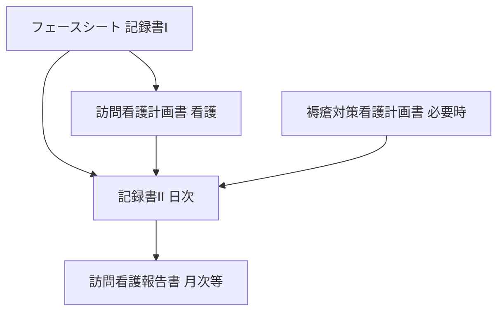

# CareLink — フェースシート・計画書・日次記録の連動分析

特定利用者の原文は載せない。**文書同士がどう参照し合うか**の設計として整理する。

---

## 1. 一方通行の「情報の流れ」

- **フェースシート**：変化がなければ**更新頻度低**。日次記録の**前提条件**（装着器具、ADL、依頼目的、主治医・関連機関）。  
- **計画書（看護）**：一定期間の**目標**と**観察・ケア項目の一覧**。日次の【O】【P】がここに**根拠を持つ**と監査で読みやすい。  
- **褥瘡計画書**：褥瘡リスク・創傷がある場合に**皮膚・DESIGN-R・除圧**の記述を日次と揃える。  
- **記録書Ⅱ**：**真実のログ**（バイタル、実施、SOAP）。  
- **報告書**：日々の記録を**要約**し、カレンダー記号とあわせて第三者（保険・居宅）へ説明する層。

---

## 2. 連動の見方（チェックリスト）

### 2.1 フェースシート → 日次記録

| フェースシートの要素 | 日次記録での期待 |
|----------------------|------------------|
| 装着器具（例：気管カニューレ、吸引） | 該当訪問で**気道管理・吸引**に触れる（実施なしでも「実施せず」の判断があれば理由） |
| 経管栄養・NG（サイズ・回数等） | 栄養関連訪問では**固定・注入・抵抗**等に触れる |
| 依頼目的のキーワード（誤嚥、褥瘡リスク、複数名訪問等） | 【O】【P】で**継続的なストーリー**として現れる |
| ADL（全介助、オムツ等） | ケア実施欄・【O】と**矛盾しない** |

### 2.2 計画書（看護） → 日次記録

| 計画書の要素 | 日次記録での期待 |
|----------------|------------------|
| 観察項目（バイタル、皮膚、NG固定、気管カニューレ、消化器症状等） | その日の訪問で関係する項目に**言及**（「変化なし」も観察の結果） |
| ケア項目（スキンケア、経管栄養、清潔保持等） | 実施した内容を**具体的動詞**で（交換、塗布、調整、吸引 等） |
| 衛生材料・器材 | 使用・交換があれば**記録書Ⅱの実施欄または【O】**に反映 |

### 2.3 褥瘡計画書 → 日次記録

- **DESIGN-R**の深さ・滲出・部位は、創処置の日に**同じ尺度**で書く。  
- リスク因子（除圧困難、失禁、栄養等）は、**予防ケアの【P】**に反映。

### 2.4 日次記録 → 報告書

- 報告書の「病状の経過」は、期間内のSOAP・バイタルから**数値レンジとトレンド**を要約したもの。  
- AIが報告書ドラフトを作る場合は、**日次の集合**から引用し、**新しい事実を捏造しない**。

---

## 3. 整合性が崩れやすいポイント（AIが検知すべき例）

- バイタル**表**と SOAP**本文**の数値不一致  
- 計画書に挙がっている**観察項目**が、実施内容から見て関係する訪問なのに**【O】が無関係**  
- フェースシートの**装着器具**と、当日【O】の**気道管理の欠落**  
- 褥瘡計画があるのに、長期間**皮膚・除圧**の記載がない（※実際の運用ルールに照らし警告）

---

## 4. 改訂履歴

| 版 | 日付 | 内容 |
|----|------|------|
| 0.1 | 2026-04-11 | 初版：文書間連動の分析枠 |
