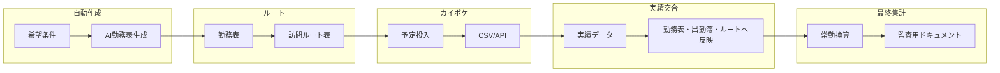

# CareLink ケアサポート — 業務サイクル全体設計

本書は、勤務計画から実績・監査までを一連の**システム化サイクル**として捉えた設計図である。実装は段階的に行い、各フェーズの**入力・出力・責任境界**を固定する。

---

## 1. 究極サイクル（ゴール像）

| 順序 | フェーズ | ざっくりした成果物 |
|------|----------|-------------------|
| 1 | **自動作成** | 夜勤希望数・休日希望などを条件に、スタッフ別の**勤務表（案）** |
| 2 | **ルート表作成** | 勤務表と利用者予定を元にした**日次訪問ルート** |
| 3 | **カイポケ連携** | 予定の**自動入力**または**入力用CSV** |
| 4 | **実績突合** | 実績を**勤務表・出勤簿・ルート表**に揃えて反映・差分把握 |
| 5 | **最終集計** | **常勤換算**と**監査に耐える**帳票・根拠の束 |

---

## 2. フェーズ別設計（入力・出力・境界）

### 2.1 自動作成（AI 勤務表）

- **入力**: マスタ（スタッフ・資格・契約労働時間）、**夜勤希望数**、**休日希望**、法定・社内ルール（連続勤務、休憩、人員下限など）、対象期間。
- **出力**: 勤務表ドラフト（シフト区分・日付・担当）、**制約違反リスト**（あれば）、採用した優先度・パラメータのログ。
- **責任**: オーナーが**最終承認**。AI は案の生成と説明責任にとどめる。労働基準・36協定の適合は**人または専門家の確認**を必須とする。
- **技術メモ**: 制約充足は「ソルバー＋ルールエンジン」と「LLMによる説明・例外提案」の併用が現実的。第1段階は**ヒューリスティック＋スプレッドシート出力**からでもよい。

### 2.2 ルート表作成

- **入力**: 確定（または案）の勤務表、利用者訪問ニーズ（頻度・時間帯・所要）、地理情報（任意）。
- **出力**: 日別・職員別の**訪問順・時間帯**が載ったルート表。
- **境界**: 医療・介護上の優先（緊急度）は**現場判断**を上書きしうる。システムは**違反・遅延リスク**を可視化する。

### 2.3 カイポケ連携（予定）

- **入力**: ルート表または正規化された「予定」中間データ。
- **出力**: カイポケへの取り込み結果、または**入力用CSV**（列定義は `integrations/` に版管理）。
- **境界**: ベンダー仕様・権限に依存。**本番は検証環境で試験**してから。個人情報はリポジトリ外で扱う。

### 2.4 実績突合

- **入力**: カイポケ等の**実績**、出勤簿、勤務表、ルート表（予定側）。
- **出力**: 突合レポート（差分・欠落・時刻ずれ）、修正反映後の**一本化された実績ビュー**。
- **既存資産**: `operations/reconcile_four_sources.py` 等を拡張し、**ルート表**を第5ソースとして統合する想定。

### 2.5 最終集計（常勤換算・監査）

- **入力**: 確定実績、人員換算ルール（施設・事業所ごとの定義）、資格係数。
- **出力**: **常勤換算**結果、監査用に**根拠トレース**（どの実績行がどの係数に入ったか）が付いた帳票。
- **境界**: 介護報酬・労務の解釈は**社内規程＋専門家**。システムは**再計算可能**であることを最優先する。

---

## 3. データの「正」とバージョン

| データ | 計画段階の正 | 運用後の正 |
|--------|--------------|------------|
| シフト | 承認済み勤務表 | 実績突合で確定した勤務実態 |
| 訪問 | ルート表（予定） | カイポケ実績＋突合結果 |
| 集計 | — | 常勤換算ルールに従った集計テーブル |

- すべての自動生成物には **生成日時・入力ファイルのハッシュまたは版名** を付与し、後から**同じ条件で再現**できるようにする（監査対応）。

---

## 4. リポジトリ内の置き場所（目安）

| 内容 | パス |
|------|------|
| 本設計 | `docs/system_design.md` |
| データ準備・照合 | `docs/manuals/` |
| 外部連携仕様 | `integrations/` |
| 運用スクリプト | `operations/` |
| 入力データ置き場 | `data/attendance_inbox/` 等（実データは Git 外） |
| レポート出力 | `data/reports/` |

---

## 5. 第1段階 — 「希望条件付き 自動勤務表作成」要件定義

第1段階のゴールは、**人が手で全部埋めなくても、制約と希望を満たす勤務表のたたき台を機械（＋AI）が出す**こと。完全自動最適化でなくてもよいが、**違反と未充足を必ず一覧化**する。

### 5.1 スコープ（やること）

- 対象期間（例: 1か月・2週間）を指定し、スタッフごとに**シフト区分**（既存の「日」「夜明」「準」「日１」「日勤２」「✖」等）を日別に割り当てる。
- **夜勤希望数**: 期間内に割り当てる夜勤（または「夜明」「準」など社内で定義した夜勤相当）の**回数目標・上限・下限**を条件に含める。
- **休日希望**: 特定日を**公休（✖）**にしたい希望を条件に含める（必須／優先／希望の**重み**を区別できるとよい）。
- 出力は **Excel または CSV** で、既存の勤務表運用（列名・シート慣習）に**近い形**に寄せる。
- **制約違反・未充足希望**を別シートまたは別ファイルで出力する。

### 5.2 スコープ外（第1段階ではやらない／後続）

- 訪問ルート最適化（フェーズ2）。
- カイポケへの自動書き込み（フェーズ3）。
- 実績との突合・常勤換算（フェーズ4–5）※ただし勤務表の**列フォーマット**は後続ツールと互換になるよう定義する。

### 5.3 入力データ要件

| 入力 | 必須項目の例 | 備考 |
|------|----------------|------|
| スタッフマスタ | 氏名、ID、資格、雇用区分、所定労働日／週 | コード体系は出勤簿・カイポケと揃える |
| 夜勤希望 | スタッフID、期間内の**希望夜勤数**（または範囲） | 実数と「これ以上やりたくない」の上限の両方がありうる |
| 休日希望 | スタッフID、**日付**、強度（必須／高／中／低） | 全員が休めない日は**必須違反**として可視化 |
| シフト定義 | 各区分の**開始・終了・休憩**（`docs/manuals/shift_codes_caresupport.md` と整合） | 夜跨ぎルールを一意に |
| 硬い制約 | 法定・社内（連続勤務上限、週労働、人員下限、資格要件） | 第1版は**簡易ルール**からで可 |

- 入力形式は **CSV または Excel** を第1候補とし、パスを引数で渡す CLI または設定ファイルで指定する。

### 5.4 出力データ要件

- **勤務表案**: 行＝スタッフ×日、列＝シフト区分または出勤／退勤時刻（後続の突合ツールが期待する**標準列**へマッピング可能なこと）。
- **説明ログ**: どの希望を満たしたか、どれを捨てたか（スコア理由）。
- **違反・警告一覧**: 例 — 必須休日未反映、夜勤数不足、人員不足日、連続勤務超過。

### 5.5 機能要件（優先度）

| 優先度 | 要件 |
|--------|------|
| P0 | 希望休・夜勤希望数を**データとして読み込み**、結果表に反映できる |
| P0 | 最低限の**ハード制約**（1人が同時に2区分にいない、公休の表記など）を検証 |
| P1 | **スコアリング**（希望を最大化しつつ違反を最小化）するソルバーまたは貪欲＋局所探索 |
| P1 | オーナーが**手修正**しやすいExcel形式（フィルタ、色分けは任意） |
| P2 | LLMによる**自然言語の希望**（チャット）を構造化データへ変換してからソルバーへ渡す |
| P2 | UI（Web）は後回し。まず **CLI + ファイル** |

### 5.6 非機能要件

- **再現性**: 同じ入力とシードで同じ案が出るモード（デバッグ・監査用）。
- **個人情報**: 生成物に**不要な利用者情報を含めない**。サンプルは架空データ。
- **承認フロー**: 「案」は必ず**オーナー承認**後に確定版とする（ファイル名またはフォルダで区別）。

### 5.7 第1段階の成果物（マイルストーン案）

1. **希望・マスタのサンプルテンプレート**（`templates/` または `data/` の非機密サンプル）。
2. **制約定義書**（v0.1、オーナー合意用）— 何をハード／ソフト制約とするか。
3. **プロトタイプスクリプト**（`operations/`）— 入力2〜3ファイル → 勤務表案＋違反一覧。
4. 既存 `docs/manuals/shift_codes_caresupport.md` との**列・区分の対応表**。

### 5.8 オープン課題（オーナー決定が必要）

- 「夜勤希望数」が指す**区分集合**（夜明のみか、準も含むか）。
- 希望休の**必須をどこまで認めるか**（カバー率が足りない日の運用）。
- 訪問看護特有の**同時人員・資格帯**の硬さ（第1段階でどこまで入れるか）。

---

## 6. 改訂履歴

| 版 | 日付 | 内容 |
|----|------|------|
| 0.1 | 2026-04-11 | 初版：全体サイクル設計＋第1段階要件 |
